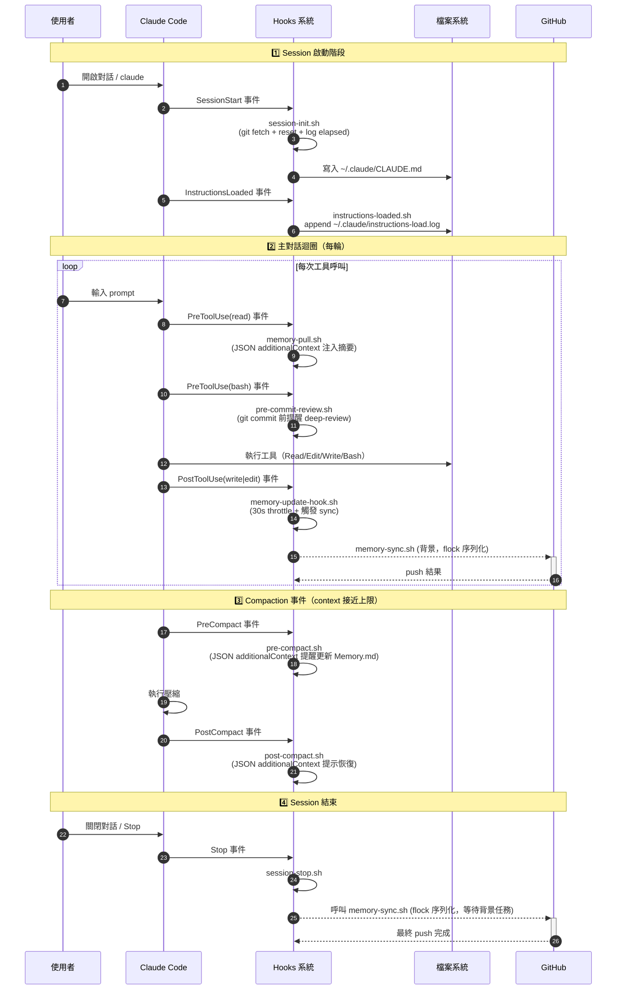
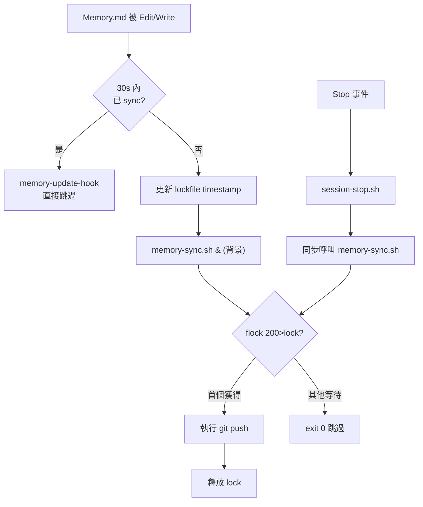

# Hook 生命週期視覺化

> 此 workspace 共 10 個 hook 腳本對應 7 種 Claude Code 事件。本文以 Mermaid 圖示完整觸發順序與依賴。
> tags: [hooks, lifecycle, mermaid, debugging]

---

## 完整生命週期 sequenceDiagram



---

## Hook 觸發矩陣

| Hook 腳本 | 對應事件 | matcher | 行為 |
|---|---|---|---|
| `session-init.sh` | `SessionStart` | `""` | git fetch + reset；建立 `~/.claude/CLAUDE.md` |
| `instructions-loaded.sh` | `InstructionsLoaded` | `""` | log 載入時機到 `~/.claude/instructions-load.log` |
| `memory-pull.sh` | `PreToolUse` | `read` | git fetch Memory.md + JSON additionalContext 注入 |
| `pre-commit-review.sh` | `PreToolUse` | `bash` | 偵測 git commit 命令時提醒 deep-review |
| `memory-update-hook.sh` | `PostToolUse` | `write\|edit` | 30s throttle + 背景觸發 memory-sync |
| `memory-sync.sh` | （由其他 hook 呼叫） | — | flock 序列化 + git commit + push（重試 4 次） |
| `memory-archive.sh` | （手動或排程） | — | Memory.md > 200 行 / 25KB 時自動歸檔 |
| `pre-compact.sh` | `PreCompact` | `""` | JSON additionalContext 提醒寫 Memory.md |
| `post-compact.sh` | `PostCompact` | `""` | JSON additionalContext 提示從 Memory 恢復 |
| `session-stop.sh` | `Stop` | `""` | 觸發 memory-sync 確保最終 push |

---

## 競態條件防護



**雙重保護**：
1. **30s throttle**（時間維度）— 避免高頻寫入觸發過多 sync
2. **flock**（程序維度）— 確保同一時間只有一個 git push 在執行，避免 race condition

---

## 除錯指南

### 確認 hook 有觸發
```bash
# 查看 instructions 載入紀錄
tail ~/.claude/instructions-load.log

# 查看壓縮事件紀錄
tail ~/.claude/compact-events.log

# 查看 sync lockfile 時間
date -d @"$(cat ~/.claude/.memory-sync-lockfile 2>/dev/null)"

# 測試單一 hook
bash .claude/hooks/session-init.sh
```

### 常見問題

| 症狀 | 可能原因 | 解法 |
|---|---|---|
| Memory.md 未自動 push | 30s throttle 內 / flock 已被佔 | 等 30s 或手動 `bash .claude/hooks/memory-sync.sh` |
| `session-init` 變慢 | repo > 5MB 卻未用 filter / 反之 | 檢查 `du -sb .git`，調整 `SIZE_THRESHOLD_BYTES` |
| Hook 命名錯誤 | 拼錯 `InstructionsLoaded` 等 | 對照官方 [Hooks 文件](https://code.claude.com/docs/en/hooks) 完整事件清單 |
| Compact hook 沒觸發 | Claude Code 版本 < v2.x | 升級 `claude --upgrade` |

---

## 擴充建議

未實作但可考慮的官方事件：
- `UserPromptSubmit` — 使用者每次按 Enter（注入 context 黃金時機）
- `SubagentStart` / `SubagentStop` — 監控 sub agent 執行狀態
- `FileChanged` — 比 PostToolUse(write|edit) 更精準的事件
- `WorktreeCreate` / `WorktreeRemove` — 配合 `isolation: worktree` 使用
- `SessionEnd` — 比 `Stop` 更精準的結束事件
